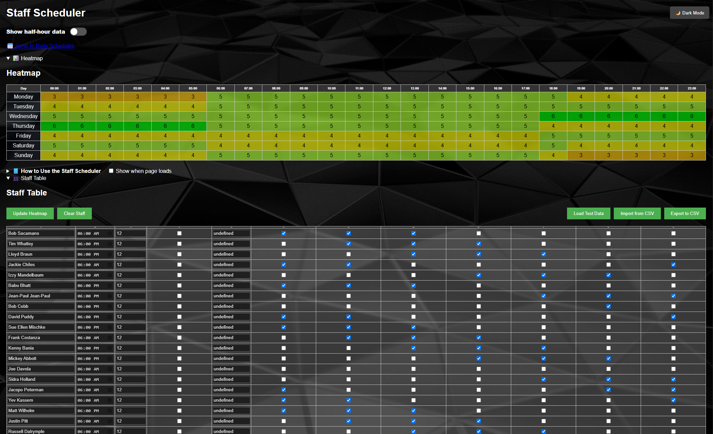

# Scheduling_Tool

A JavaScript-based visual staff scheduling tool with built-in heatmap generation, daily shift tables, CSV import/export, and dark mode support. Ideal for teams, managers, or admins who need a clear, fast way to manage complex schedules.

 <!-- Optional: Add a screenshot here -->

## ✨ Features

- ✅ **Dynamic Staff Input Table**  
  Add up to 30 staff members with start time, hours worked, lunch break, and active weekdays.

- 🎯 **Automatic End Time Calculation**  
  End times are automatically calculated from start time, hours, and lunch settings (HH:mm format).

- 🔥 **Real-Time Heatmap**  
  Visualizes how many staff are scheduled at each hour block throughout the week.

- 📅 **Daily Schedule Tables**  
  View per-day shift distribution tables across 24-hour (or 48 half-hour) intervals.

- 🌓 **Dark Mode + Light Mode**  
  Persistent user preference, toggleable with a switch.

- 🧊 **Glassmorphism UI with Background Themes**  
  Transparent tables and stylish visuals adapt to dark/light mode.

- 📂 **CSV Import/Export**  
  Easily save and reload staff rosters using CSV files.

- 🧠 **LocalStorage Support**  
  Saves the user’s schedule data in-browser automatically.

- 🛠 **Recalculate End Times Button**  
  Refresh time calculations for all entries with one click.

---

## 🔧 Usage

1. Open `index.html` in your browser.
2. Fill in the staff table or import a CSV.
3. Click “Update Heatmap” to visualize schedules.
4. Export your schedule or toggle views as needed.

---

## 📄 CSV Format

```csv
Name,Start Time,Hours,Lunch,End Time,Monday,Tuesday,Wednesday,Thursday,Friday,Saturday,Sunday
Jane Doe,06:00,8,No,14:00,Yes,Yes,No,No,Yes,No,No
